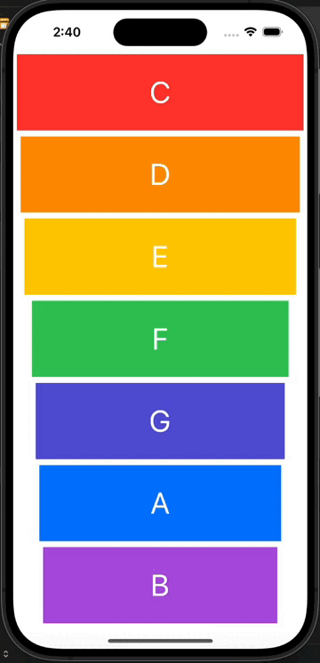

# Xylophone

##  Goal

The Xylophone app is a simple yet engaging application designed to allow users to play music on a virtual xylophone using their iOS device. Built using AVFoundation and Swift, the app offers a user-friendly interface with a set of virtual xylophone keys corresponding to different musical notes. Key features of the app include:

## AVFoundation Integration 
The Xylophone app leverages AVFoundation, Apple's framework for working with audio and video media, to produce high-quality sound output. AVFoundation is used to handle audio playback and generate the musical notes corresponding to each xylophone key.

## Virtual Xylophone Interface 
The app presents users with a virtual xylophone interface, consisting of multiple colorful keys representing different musical notes. Users can tap on these keys to produce corresponding sounds, allowing them to play melodies and create music.

## Responsive User Interaction 
The Xylophone app ensures a responsive and intuitive user experience by accurately detecting user interactions with the virtual xylophone keys. Each tap on a key triggers the playback of the corresponding musical note, allowing users to play melodies with ease.

## Customizable Design 
The app offers a customizable design, allowing developers to customize the appearance of the virtual xylophone keys, background, and other UI elements to suit their preferences or match a specific theme.

